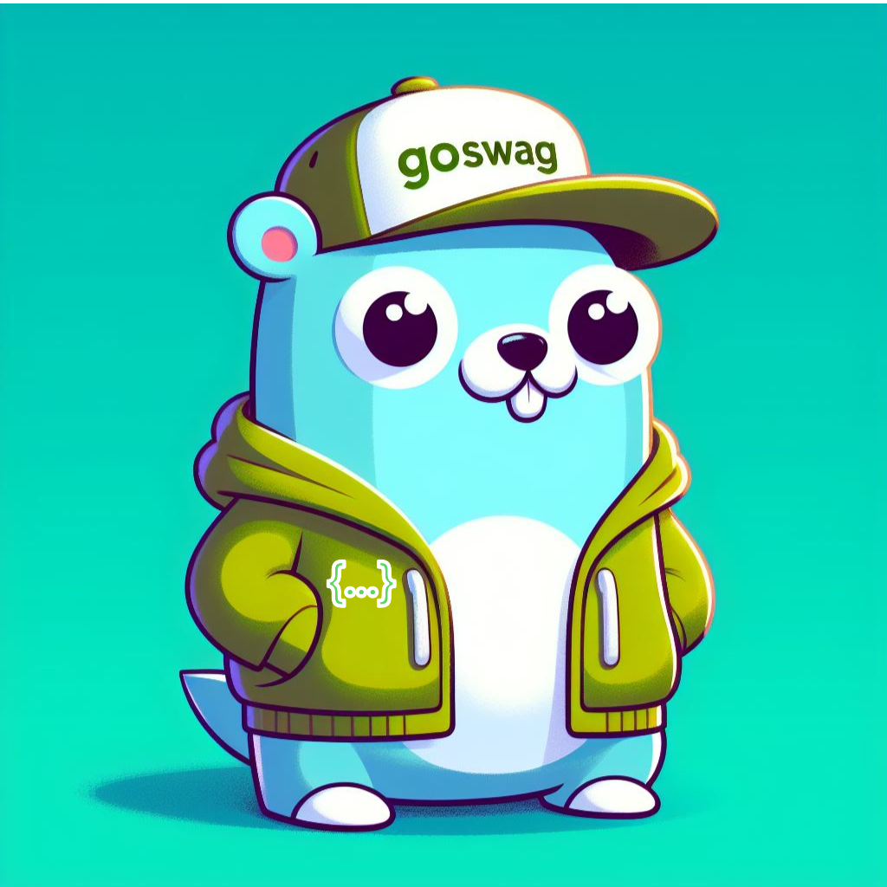
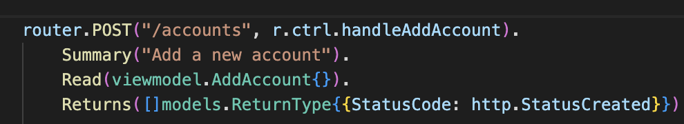
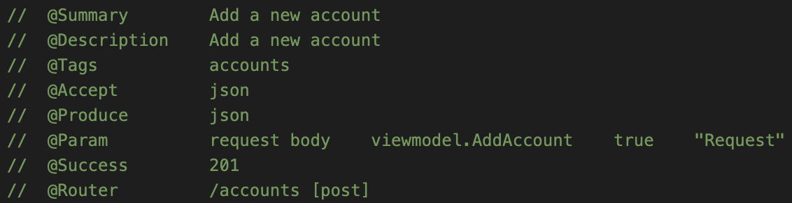
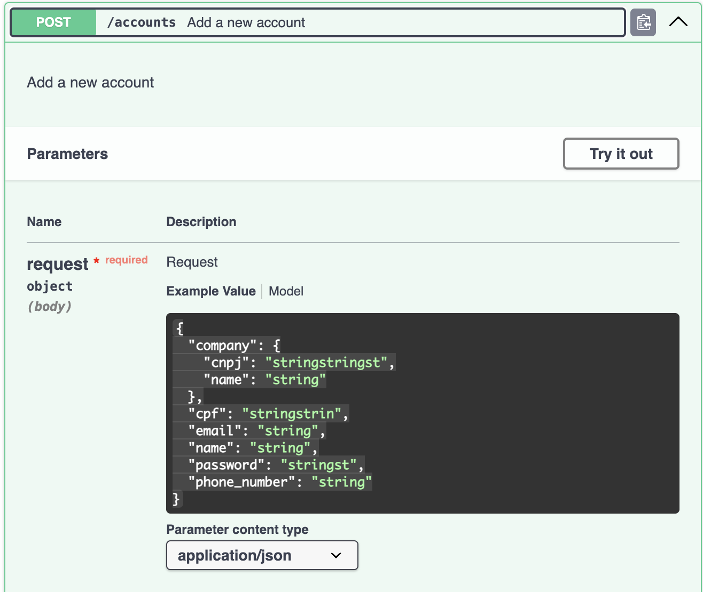

# goswag

<p align="center">
 <b>To help you auto generate swagger for your golang APIs</b><br>
  <br>
    <a href="https://github.com/diegoclair/goswag/tags" alt="GitHub tag">
     
    </a>
    <a href='https://coveralls.io/github/diegoclair/goswag?branch=main'>
     
    </a>
    <a href="https://github.com/diegoclair/goswag/actions">
     
    </a>
    <a href="https://github.com/diegoclair/goswag/contributors" alt="Contributors">
     
    </a>
    <a href="https://opensource.org/licenses/MIT">
     
    </a>
    <a href='https://goreportcard.com/badge/github.com/diegoclair/goswag'>
     
    </a>
</p>

## Introduction
It will extend your Go framework by providing methods to generate a separate file containing all the necessary comments. These comments enable the Swag library to effortlessly generate Swagger files.

### - Why: 
I was searching for an automated method to generate Swagger documentation for Golang APIs. I came across the [`swaggo/swag`](https://github.com/swaggo/swag) lib, which seems to be the most popular choice or, at the very least, has numerous articles and tutorials promoting its use. However, I was dissatisfied with the process of adding extensive comments throughout the main file and other files containing handler functions. As a result, I decided to develop the goswag library.

### - How:
Goswag simplifies the process of integrating Swagger documentation generation into your Go projects. By seamlessly aligning with your chosen framework's usage patterns, Goswag ensures a smooth integration experience.

For instance, if your framework uses a POST method with specific parameters, Goswag mirrors these method and parameters, streamlining the integration process. This principle applies across supported frameworks, ensuring consistency and ease of use.

**Write this:**  
  

**Instead of this:**

  

**And will have the same result:**



### - Supported Libraries
- [echo](https://github.com/labstack/echo) 
- [gin](https://github.com/gin-gonic/gin)

## Getting started

### 1 - Modifying your current project
When initializing your current framework, such as `e := echo.New()`, begin by replacing it with `ge := goswag.NewEcho()` or `gg := goswag.NewGin(gin)` by passing the Gin instance as a parameter for the Gin framework. 

### 2 - Using original framework configuration
If you intend to utilize the framework with alternative configurations, for instance: `e.Debug = true`, you can access `e` as follows: `ge.Echo().Debug = true` achieving identical results.

### 3 - Add annotations to your routes:
After completing the initial setup, your routes are established without errors and require no further changes. However, your routes will now possess additional methods:
- `Summary`: Provides a brief overview of your route.
- `Description`: Offers a detailed description of your route (If not set, it defaults to the summary).
- `Accepts`: The default value is *json*. f you wish to incorporate different values, please refer to the list of possible values [here](https://github.com/swaggo/swag#mime-types). 
- `Produces`: The default value is *json*. To include different values, consult the list of possible options [here](https://github.com/swaggo/swag#mime-types).
- `Read`: ISpecifies the request body received by your routes.
- `Returns`: Is an array of ReturnType{}. Your route can have multiples returns (e.g., success, errors e etc). Refer to the [interface reference](https://github.com/diegoclair/goswag/blob/main/models/models.go#L64) for detailed usage information.
```go
type ReturnType struct {
	StatusCode int
	Body       interface{}
	// example: map[jsonFieldName]fieldType{}
	OverrideStructFields map[string]interface{}
}
```
- `QueryParam`: Defines the query parameters of the route and specifies if they are required.
- `HeaderParam`: Defines the header parameters of the route and specifies if they are required.

### 4 - Generating your Swagger Documentation
The method used to instantiate your router, either `NewEcho()` or `NewGin()` includes a function called `GenerateSwagger()`.  
After setting up all your routes (including annotations), you can invoke `GenerateSwagger()` to generate your swagger documentation. However, this implies that if your route setup relies on services like a running database or RabbitMQ, you can only generate your Swagger documentation when your entire infrastructure is operational, which is not ideal.

#### Recommended Approach:
The recommended approach is to have a separate main file where you do not need to provide real connections for your route setup.

Consider a file named `server.go` with the following setup:
```go
func SetupRoutes(db *sql.DB) *echo.Echo {
    e := echo.New()
    handlers := handlers.New(db)
    e.GET("/hello", handlers.HandleHello)
     
    return e
}
```
In order to start your router, you currently need to provide a database connection. However, this requirement is unnecessary for generating Swagger documentation.

#### Recommended Approach Setup
- Install [`swag`](https://github.com/swaggo/swag/blob/master/README.md#getting-started). It is necessary for generate swagger documents.
- Create a folder in your root project folder named `goswag`.
- Inside the `goswag` folder, create a file called `main.go` with package main.
- Inside of this file, create your main function that will invoke your routerSetup.
    - You can add comments to the main.go file for your Swagger, similar to [this example](https://github.com/swaggo/swag/blob/master/README.md#how-to-use-it-with-gin) in item 2.

```go
// @title           GoSwag example API
// @version         1.0
func main() {
    // Here you have already used goswag for your route setup, added annotations and change it return to goswag.Echo or Gin interfaces
    ge := server.SetupRoutes(nil)
    ge.GenerateSwagger() //will generate your swagger
}
```
- Create a Makefile and add the following command:
```Make
.PHONY: docs
docs:
	@cd goswag && \
	go run main.go && \
	cd .. && \
	swag init -g ./goswag/main.go && \
	swag fmt -d ./goswag/
```

Now you can run the command `make docs`.
This will create a new `goswag.go` file inside your `goswag` folder, containing all handlers and necessary comments for the swag library to generate the Swagger files inside the `docs`folder.

## More features
You can add description for fields, add if they are required or not.  
For this struct fields features and more, you can follow the [swag documentation](https://github.com/swaggo/swag) to understand how to add it.

## Contributing

**Contributions are welcomed. :)**  
You can contribute not only with code but also by enhancing these `README.md` docs, writing articles, using Goswag and providing feedback.  
  
To contribute, please follow these steps:

1. Fork the repository
2. Create a new feature branch (`git checkout -b feature/<FEATURE NAME>`)
3. Make the necessary changes
4. Commit your changes (`git commit -m "Add some feature"`)
5. Push your changes to your forked repository (`git push origin feature/<FEATURE NAME>`)
6. Create a pull request to the main branch of the repository

## License

Goswag is [MIT licensed](./LICENSE).

### TODO:
- NewGin() does not implement the method Match or Any from gin, because there are no way (yet) to define the same (summary,responses,bodies) for all methods
